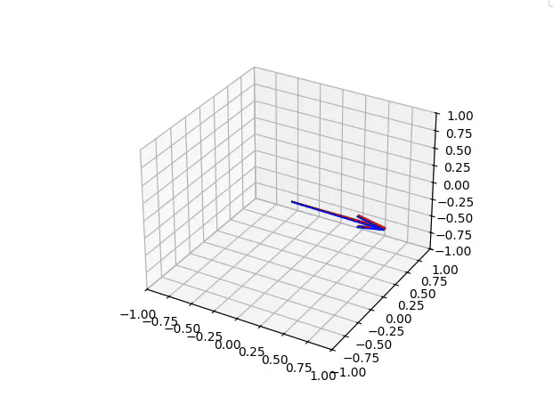

# Clone Robotics Coding Task: Driver for Custom Protocol

In this coding task, I have created a publisher and consumer using IPC socket communication. The publisher sends packed binary data of a custom `Payload_IMU` class to the consumer. The consumer unpacks this data and extracts rotation information from these sensors. This code also features an Extended Kalman Filter for Sensor Fusion and a Visualizer.

## Getting Started

### Basic Setup
Python 3.10.x was used to write the code in this repo. Please use the provided `requirements.txt` to install any or all dependencies you don't have already.

```
pip install -r requirements.txt
```

### Setup with Conda

If using Conda you can create a new Conda Environment using the provided `environment.yml` file
```
conda env create -f environment.yml
```
After this completes you can open the Conda Environment by typing
```
conda activate clone_task
```

## Running the System

To run the system, in separate terminal windows first run the `consumer.py` then run `publisher.py`. Both programs have default values for all the arguments, so they can be run as-is.

### Recommendations

To run the socket communication as originally scoped, with random data and no visualization, then run the following:

```
python3 consumer.py --no-visualize
```
```
python3 publisher.py
```

> **Note:** This is good if you want to see how quickly things perform without being slowed down by the visualizer, but the Extended Kalman Filter results won't look good since the data is random!

To run the socket communication with the CSV data and the visualizer (suggested), then run the following:
```
python3 consumer.py --timeout-ms 200
```

```
python3 publisher.py --frequency-hz 100 --data-mode csv
```
> **Note:** The visualizer slows down the processing so the publisher may finish sending CSV data before the consumer's thread finishes.

### Consumer Arguments

* `--socket-path`
    * Allows user to change the socket path
    * Default Value: `/tmp/imu_sensor_socket`
    * Tested using `/tmp/anything`
* `--log-level`
    * Allows user to change minimum level of log to be printed
    * Default Value: `INFO`
    * Options: `[INFO, WARNING, ERROR, CRITICAL]`
* `--timeout-ms`
    * Allows adjustment of timeout in milliseconds for data to be recieved
    * Default Value: `100`
    * Note: There is a different static connection timeout of 60 seconds (if the publisher disconnects, give 60 seconds to reconnect or exit)
* `--max-timeouts`
    * Timeouts are treated as warnings, but if it timeouts too many times then the program will exit.
    * Default Value: `10`
* `--visualize` or `--no-visualize`
    * Determines if the visualizer will be used or not by the consumer
    * Default: `True (visualize)`
* `--verbosity-rate` - Default Value: `500`
    * Consumer will print every X packets recieved and processed
    * Default Value: `500`

Example:
```
python3 consumer.py --socket-path "/tmp/socket_stream" --log-level INFO --timeout-ms 100 --max-timouts 10 --visualize --verbosity-rate 500
```
### Publisher Arguments

* `--socket-path`
    * Allows user to change the socket path
    * Default Value: `/tmp/imu_sensor_socket`
* `--log-level`
    * Allows user to change minimum level of log to be printed
    * Default Value: `INFO`
    * Options: `[INFO, WARNING, ERROR, CRITICAL]`
* `--frequency-hz`
    * Allows user to set rate data is sent to the consumer
    * Default Value: `500`
* `--retries`
    * If connection is from the consumer side, the publisher will attempt to reconnect this many times
    * Each retry is on a static 5 second cooldown. 
    * Default: `10`
* `--data-mode`
    * Allows the publisher to either provide data from the provided CSV, or from randomly generated data.
    * Default: `random`, Options: `["csv", "random"]`
    * Would have made the CSV path an argument, but this did not seem necessary.

Example:

```
python3 publisher.py --socket-path "/tmp/socket_stream" --log-level INFO --frequency-hz 500 --retries 10 --data-mode csv
```
## Bonus Features

### Extended Kalman Filter for Sensor Fusion

The accelerometer and magnetometer are combined using standard equations, as the accelerometer provides roll and pitch, and the magnetometer (adjusted by roll and pitch) provide the yaw. 

The gyroscope is updated iteratively with each dynamic timestep but can be prone to drift.

An Extended Kalman Filter has been implemented, using the Gyroscope as the prediction and the Fused Accelerometer + Magnetometer as the measurement. Since we assume that this Fused orientation is true, the EKF prioritizes alignment with the measurement but is smoothened by the gyroscope prediction. 

> **Note: The orientations are converted to quaternions to prevent gimble-locks**

### Visualizer
The consumer's processing thread has a visualizer that updates live with the processed data. The visualizer is slower than the data being streamed and processed. To ensure real-time data sending, the visualizer runs on a separate thread.

<p align="center">
  
</p>

The <span style="color:cyan"><b>blue arrow</b></span> is the fused orientation using EKF.

The <span style="color:green"><b>green arrow</b></span> is the raw orientation (quaternion) derived from the accelerometer and magnetometer fusion. This is just for visualization's sake.

The <span style="color:red"><b>red arrow</b></span> is the raw Gyroscope orientation updated on the first orientation as Euler Angles. This is just for visualization's sake.

> By watching the visualizer, it is evident that the CSV data for the accelerometer and magnetometer are noisy, but the gyroscope experiences drift over time. EKF helps fix these issues. 

> **Note:** Since the visualizer was added towards the end and is running in a thread, `matplotlib` throws an ignored error when exiting. I would have accomodated this, but in the interest of time and since it was out of scope of the main requirements for this task I did not.

## Changes Made

### Impractical Timestamp

The suggested timestamp was a Unix Timestamp, an integer representing seconds since the Unix Epoch. However, this poses two issues: (1) Whole seconds does not provide enough fidelity for the gyroscope rotation and (2) expanding the unit to milliseconds or nanoseconds exceeds the limitations of an unsigned 32 bit integer. 

> **Solution:** Extend the timestamp to account for milliseconds as an unsigned long long in the data structure

## Future Work

If I had more time, there are some things I would refine and fix:

* The publisher handles IMU input errors, but doesn't have retry behavior. Given more time I would have added a limit to the number of IMU errors before exiting
* Python doesn't seem too happy with using `matplotlib` in a thread, given more time I would have looked into using other libraries for thread safe and quick plotting of 3D data
* The visualizer was added later on, and there are some conversions, such as euler to quaternion, that could be done fewer times to ideally help improve speed marginally
* Having EKF is great, but I would have liked to provide more sensor fusion modes

## Authors

- **Madhusha Goonesekera** - A Masters in Robotic System Development graduate from Carnegie Mellon University, and holding Bachelors Degrees in Mechanical Engineering and Computer Science from the University of California - Davis. With a longstanding interest in applications of biomimicry for robotics, Madhusha hopes to work at Clone Robotics to develop software stacks for what he beleives is the most interesting humanoid robot on the market. 

## License

This project is licensed under the [MIT License](LICENSE)


## Acknowledgements

* **Clone Robotics** for the opportunity to solve this coding task and possibly work for this company.
* **Carnegie Mellon University and the MRSD program** for giving me the tools to make writing this repo possible.
* **iotaMotion Inc.**, where I developed a greater understanding of socket communication with tools such as gRPC and OpenIGTLink.

### Some References

* [Real Python: Sockets](https://realpython.com/python-sockets/)
* [Python Docs, for Threading and Queues](https://docs.python.org/3/library/)
* [Numpy-Quaternion Docs](https://quaternion.readthedocs.io/en/latest/)
* [xioTechnologies Fusion Sensor Data CSV](https://github.com/xioTechnologies/Fusion/blob/main/Python/sensor_data.csv)
* [Michael Wrona's Blog](https://mwrona.com/posts/attitude-ekf/)


### Artificial Intelligence & Integrity Statement

AI Tools such as ChatGPT were used for this Coding Task. AI Tools were used to look up syntax/functions within libraries used, debuggin, and to review and verify math / theory.

Beyond this, tools such as Google (including in part Gemini), and websites such as StackOverflow and Reddit were used to get inspiration, especially for implementing EKF. 